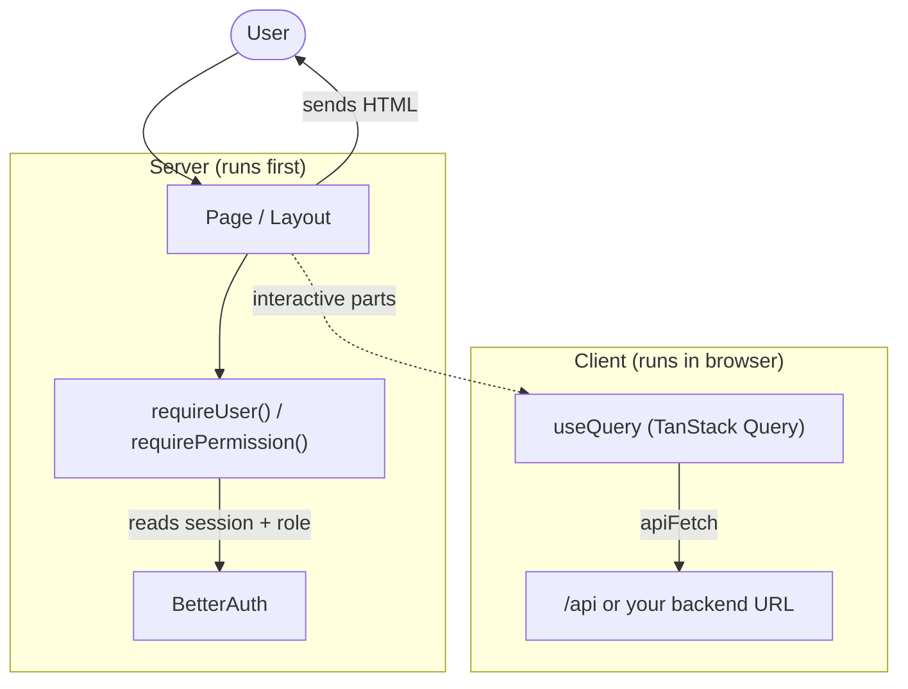

<div align="center">

<h1>Next.js Elite: A production-ready Next.js boilerplate</h1>
<p><strong>Frontend-first, API-driven, batteries included.</strong> Built on Next.js 16 + React 19, with i18n, RBAC, BetterAuth, and a polished DX out of the box.</p>


<br/><br/>

[**Live Demo** ↗](https://nextjs-elite-boilerplate.vercel.app/) · [**Use this template** ↗](https://github.com/salmanshahriar/Nextjs-Elite-Boilerplate/generate) · [Report Bug ↗](https://github.com/salmanshahriar/Nextjs-Elite-Boilerplate/issues) · [Request Feature ↗](https://github.com/salmanshahriar/Nextjs-Elite-Boilerplate/issues)


</div>
<br/><br/>

## Why this boilerplate

Most Next.js starters either ship the bare minimum or bolt on a database/ORM you don't need. **Next.js Elite is intentionally frontend-first**; it consumes APIs (REST/GraphQL/BFF) instead of owning a database, so you can drop it on top of any backend you already have.
<br/><br/>

## Integrated features

| Feature                          | Description                                                                                                                                                                                                                                                                                       |
| -------------------------------- | ------------------------------------------------------------------------------------------------------------------------------------------------------------------------------------------------------------------------------------------------------------------------------------------------- |
| **Auth (BetterAuth)**            | Email/password with optional Google OAuth via `/api/auth/*`. Admin role via `AUTH_ADMIN_EMAILS` / `NEXT_PUBLIC_AUTH_ADMIN_EMAILS`. Sessions use BetterAuth defaults (plug in your own storage adapter for multi-instance prod).                                                                   |
| **RBAC + role-based routing**    | Permission-based RBAC (`user`, `admin`) with server-side guards (`requireUser`, `requirePermission`) for Server Components, paired with [parallel routes](https://nextjs.org/docs/app/building-your-application/routing/parallel-routes) (`@admin`, `@user`) so `/dashboard` stays role-agnostic. |
| **Type-safe i18n (6 languages)** | [`next-intl`](https://next-intl.dev/) with **cookie-based locale** (no URL prefix) for English, বাংলা, العربية (RTL), Français, Español, and 简体中文. Keys are type-checked (`t("navigation.home")` works; typos fail compile-time).                                                             |
| **UI kit**                       | [shadcn/ui](https://ui.shadcn.com/) (Radix + CVA + Tailwind) with copy-and-own components.                                                                                                                                                                                                        |
| **Central site config**          | Single [`src/features/site/site.config.json`](src/features/site/site.config.json) drives app name, SEO, languages, organization, theme, social meta, sitemap, robots, and `manifest.webmanifest`.                                                                                                 |
| **SEO that scales**              | Open Graph, Twitter Cards, JSON-LD, canonical URLs, language alternates, dynamic sitemap + robots — driven from the central config.                                                                                                                                                               |
| **Type-safe env**                | [`@t3-oss/env-nextjs`](https://env.t3.gg/) + Zod with server/client split; invalid variables fail early.                                                                                                                                                                                          |
| **Forms**                        | [React Hook Form](https://react-hook-form.com/) + [Zod 4](https://zod.dev/) for fast, accessible forms with shared validation.                                                                                                                                                                    |
| **API layer**                    | `apiFetch` (`ofetch` + Zod) in `src/libs/api-client.ts` defaults to same-origin `/api`; [TanStack Query](https://tanstack.com/query/latest) on the client. Example `users` feature — point at your backend or add route handlers.                                                                 |
| **Demo mode (opt-in)**           | Self-contained `src/features/auth/demo/` module adds click-to-fill + auto-register behind `NEXT_PUBLIC_DEMO_MODE`. Turn it off (or delete the folder) for production.                                                                                                                             |
| **Observability & protection**   | [Sentry](https://sentry.io/) instrumentation, `pino` server logging, and optional `getRateLimiter()` in `src/libs/rate-limit.ts` ([Upstash](https://upstash.com/) when `UPSTASH_REDIS_*` is set).                                                                                                 |
| **Quality gates**                | [ESLint 9](https://eslint.org/) + [Prettier](https://prettier.io/), [Vitest](https://vitest.dev/) + React Testing Library, and [Playwright](https://playwright.dev/) E2E.                                                                                                                         |
| **DX automation**                | [Lefthook](https://github.com/evilmartians/lefthook) pre-commit, [Commitlint 21](https://commitlint.js.org/) commit-msg, [Knip](https://knip.dev/) dead-code/deps hygiene, [Renovate](https://docs.renovatebot.com/) dependency updates, and GitHub Actions CI (Node 22 + npm 11).                |
| **Health check**                 | `GET /api/health` returns `{ "status": "ok" }` for load balancers and probes.                                                                                                                                                                                                                     |

<br/><br/>

## Lighthouse report

<div align="center">

</div>

<br/><br/>

## Quick Start

### Prerequisites

- Node.js **22.12** or later
- **npm 11**

### Install & run

```bash
git clone https://github.com/salmanshahriar/Nextjs-Elite-Boilerplate.git
cd Nextjs-Elite-Boilerplate
npm ci
npm install
cp .env.example .env
npm run dev
```

Open [http://localhost:3000](http://localhost:3000).

### Demo login

For instant previews, the boilerplate ships with a **self-contained demo module** at `src/features/auth/demo/`. With `NEXT_PUBLIC_DEMO_MODE=true`, the login page renders a click-to-fill credentials panel and auto-registers the seed accounts in BetterAuth on first sign-in:

| Role  | Email            | Password   |
| ----- | ---------------- | ---------- |
| User  | `user@test.com`  | `12345678` |
| Admin | `admin@test.com` | `12345678` |

> Going to production? Set `NEXT_PUBLIC_DEMO_MODE=false` (or delete `src/features/auth/demo/` entirely — it's the only place that imports from itself). The login form, auth provider, and RBAC stay untouched.

<br/><br/>

## Deploy

### Vercel

[](https://vercel.com/new/clone?repository-url=https://github.com/salmanshahriar/Nextjs-Elite-Boilerplate)

Set the env vars from `.env.example` in your Vercel project (Production + Preview).

### Docker

Runs on **Node 22 Alpine** (`Dockerfile`). Build and run:

```bash
cp .env.example .env
docker build -t nextjs-elite-boilerplate .
docker run --rm --env-file .env -p 3000:3000 nextjs-elite-boilerplate
```

Or with Compose:

```bash
docker compose up --build
```

<br/><br/>

## Project Structure

```
.
├── .github/
│   ├── workflows/            CI: check.yml + playwright.yml
│   └── renovate.json         Dependency updates
├── config/                   vitest.config.ts, vitest.setup.ts
├── e2e/                      Playwright specs + playwright.config.ts
├── messages/                 next-intl translations (en, bn, ar, fr, es, zh)
├── public/                   Static assets
├── tests/                    Vitest specs (auth, i18n)
├── components.json           shadcn/ui CLI config
├── eslint.config.js
├── knip.json
├── next.config.mjs
├── package.json              scripts; Prettier + Commitlint config
├── package-lock.json         npm lockfile (single source of truth)
├── proxy.ts                  Next.js middleware (pass-through)
├── tsconfig.json
├── lefthook.yml              Git hooks (pre-commit, commit-msg)
├── src/
│   ├── app/                  App Router
│   │   ├── (auth)/           Login & auth pages
│   │   ├── (public)/         Marketing pages (home, about)
│   │   ├── (protected)/      Authenticated area + RBAC
│   │   │   ├── @admin/       Admin dashboard slot
│   │   │   ├── @user/        User dashboard slot
│   │   │   └── layout.tsx    Picks slot based on permissions
│   │   ├── api/              Route handlers (BetterAuth, health)
│   │   ├── layout.tsx        Root layout, SEO, providers
│   │   ├── providers.tsx     Theme + Auth + TanStack Query
│   │   ├── manifest.ts       Web app manifest
│   │   ├── robots.ts         robots.txt
│   │   └── sitemap.ts        Dynamic sitemap
│   ├── components/
│   │   ├── shared/           App-level shared components
│   │   ├── icons/            Icon components
│   │   └── ui/               shadcn/ui primitives
│   ├── features/             Feature modules (vertical slices)
│   │   ├── auth/             BetterAuth + RBAC
│   │   │   ├── lib/          auth + auth-client (BetterAuth singletons)
│   │   │   ├── server/       Server-only helpers (getCurrentUser)
│   │   │   ├── hooks/        Auth provider + useAuth hook
│   │   │   ├── components/   Login form, register form
│   │   │   ├── demo/         Self-contained demo module (delete for prod)
│   │   │   ├── rbac/         permissions, roles, can, require
│   │   │   └── schemas/      Zod login + register schemas
│   │   ├── i18n/             next-intl config (routing, request, actions)
│   │   ├── navigation/       Header + Sidebar
│   │   ├── site/             siteConfig + locale utilities
│   │   ├── theme/            Theme provider + toggle
│   │   └── users/            Example feature: api, hooks, schemas
│   ├── hooks/                Cross-feature hooks
│   ├── libs/                 Cross-cutting infra (api-client, env, logger,
│   │                         rate-limit, query-client, utils)
│   ├── schemas/              Cross-cutting Zod schemas (api responses)
│   ├── instrumentation.ts    Server Sentry init
│   ├── instrumentation-client.ts  Client Sentry init
│   └── global.d.ts           next-intl type augmentation
└── ...
```

<br/><br/>

## Architecture Overview

The big picture: a page is rendered on the server, auth/role is checked there, and any live data is fetched on the client.



**How a request flows:**

1. **User opens a page** — the Server Component renders first.
2. **Auth + role check** — `requireUser()` / `requirePermission()` read the BetterAuth session and redirect to `/login` or `/unauthorized` if needed.
3. **HTML is sent** to the browser; translations come from `messages/` via `next-intl`.
4. **Live data** (lists, forms, etc.) is fetched on the client with TanStack Query → `apiFetch` → your API.

> Optional add-ons: **Sentry** for error tracking and **Upstash Redis** for the rate-limit helper — both activate only when their env vars are set.

### Auth & RBAC

- BetterAuth runs as a **singleton** in `src/features/auth/lib/auth.ts` and is exposed at **`/api/auth/*`** via `src/app/api/auth/[...all]/route.ts`. Sessions use BetterAuth's **default storage**; add a database or Redis adapter when you need durable or multi-instance sessions.
- `getCurrentUser()` reads the session, maps `AUTH_ADMIN_EMAILS` to a role, and attaches permissions. Server Components call `requireUser()` / `requirePermission(...)` from `src/features/auth/rbac/require.ts` — invalid sessions redirect to `/login`, unauthorized users to `/unauthorized`.
- Permissions are defined in `rbac/roles.ts` and checked with `hasPermission(...)` from `rbac/can.ts`. Extend the `AuthPermission` union and `ROLE_PERMISSIONS` map as your feature surface grows.

```ts
// Server Component example
import { requirePermission } from '@/features/auth/rbac/require';

const AdminDashboardPage = async () => {
  const user = await requirePermission('dashboard.view:admin');
  return <h1>Welcome {user.email}</h1>;
};

export default AdminDashboardPage;
```

### Forms with React Hook Form + Zod

```tsx
'use client';

import { zodResolver } from '@hookform/resolvers/zod';
import { useForm } from 'react-hook-form';
import { loginSchema, type LoginInput } from '@/features/auth/schemas/login';

const form = useForm<LoginInput>({
  resolver: zodResolver(loginSchema),
  defaultValues: { email: '', password: '' },
});
```

<br/><br/>

## Configuration

### Environment variables

Every variable is documented in [`.env.example`](.env.example) and validated by `src/libs/env.ts` (T3 Env), so invalid values fail fast. A few notes:

- `BETTER_AUTH_URL` is optional — derived from `VERCEL_URL` in production, `http://localhost:3000` locally.
- `BETTER_AUTH_SECRET` (32+ chars) must be set at runtime in production. A missing secret logs a warning instead of crashing the build.
- Set `SKIP_ENV_VALIDATION=true` in CI / Docker build steps when env vars aren't available yet.

### Site & SEO configuration

[`src/features/site/site.config.json`](src/features/site/site.config.json) is the single source of truth for app name, SEO meta, social cards, JSON-LD organization schema, supported locales, theme colors, and PWA manifest. The config is parsed at build time through a Zod schema in [`src/features/site/config.ts`](src/features/site/config.ts), so a typo or missing field fails fast.

It drives:

- `src/app/layout.tsx` — root `<head>`, OpenGraph, Twitter Cards, JSON-LD `Organization` + `WebSite` schema, language alternates, theme color
- `src/app/sitemap.ts` — dynamic sitemap with all locales
- `src/app/robots.ts` — robots.txt
- `src/app/manifest.ts` — PWA web app manifest
- `next-intl` — supported locales and default locale

```jsonc
{
  "appName": "Next.js Elite",
  "domain": "https://yourdomain.com",
  "tagline": "Frontend-first, API-driven, batteries included.",
  "title": "Next.js Elite — Production-Ready SaaS Boilerplate",
  "description": "Frontend-first Next.js 16 + React 19 + TypeScript 6 boilerplate with i18n, RBAC and BetterAuth.",
  "languages": {
    "supported": ["en", "bn", "ar", "fr", "es", "zh"],
    "default": "en",
  },
  "organization": {
    "name": "Your Organization",
    "url": "https://yourdomain.com",
  },
  "images": {
    "og": "/Nextjs-Elite-OG-Image.webp",
    "cover": "/Nextjs-Elite-Cover.webp",
  },
  "manifest": "/manifest.webmanifest",
}
```

> For the full schema and all available fields, see `src/features/site/site.config.json` and the Zod parser in `src/features/site/config.ts`.

### Adding a language

1. Add the locale code to `languages.supported` in `site.config.json` and add an entry under `languages.locales`.
2. Create `messages/<locale>.json` mirroring `messages/en.json`.
3. The `next-intl` runtime picks it up automatically; types update from `src/global.d.ts`.

### Adding a role

1. Append the role to the `UserRole` union in `src/features/auth/rbac/permissions.ts`.
2. Map permissions for the role in `src/features/auth/rbac/roles.ts`.
3. Optional: add a parallel route slot — `src/app/(protected)/@<role>/...` — and update `(protected)/layout.tsx` to render it based on permissions.
   <br/><br/>

## Available Scripts

| Command              | Description                                  |
| -------------------- | -------------------------------------------- |
| `npm run dev`        | Start the dev server (Turbopack)             |
| `npm run build`      | Production build                             |
| `npm run start`      | Start the production server                  |
| `npm run analyze`    | Build with `@next/bundle-analyzer`           |
| `npm run typecheck`  | `tsc --noEmit`                               |
| `npm run lint`       | ESLint + Prettier check                      |
| `npm run lint:fix`   | Auto-fix ESLint + Prettier                   |
| `npm run knip`       | Detect unused files / exports / dependencies |
| `npm run check`      | typecheck + lint + knip + tests (CI gate)    |
| `npm run test`       | Vitest run                                   |
| `npm run test:watch` | Vitest watch                                 |
| `npm run e2e`        | Playwright E2E                               |
| `npm run e2e:ui`     | Playwright UI mode                           |
| `npm run e2e:webkit` | Playwright WebKit only                       |

<br/><br/>

## Testing

- **Unit / component:** Vitest + React Testing Library. Feature specs in `tests/`; colocated `*.test.ts(x)` next to components (e.g. `src/components/ui/`) and libs.
- **End-to-end:** Playwright in `e2e/`. `npm run e2e` boots the dev server automatically; `npm run e2e:ui` is great for debugging selectors and replaying failures locally.
- **WebKit-only setup** (saves disk space): `npx playwright install webkit && npm run e2e:webkit`.
  <br/><br/>

## CI/CD

- `.github/workflows/check.yml` — typecheck → lint → knip → unit tests → build, on every push and PR.
- `.github/workflows/playwright.yml` — full Playwright suite (Chromium, Firefox, WebKit).
- `.github/renovate.json` — groups non-major dependency updates and automerges patches.
  <br/><br/>

## Best for

- SaaS apps with multiple user roles
- Internationalized products (LTR + RTL)
- Frontends consuming an existing backend / BFF
- Enterprise apps with auth, RBAC, observability needs

Probably overkill for:

- Single-page landing sites
- Apps that need a tightly-coupled DB layer (this is intentionally API-only)
  <br/><br/>

## Contributing

1. Fork & branch from `main` (`feat/...`, `fix/...`, etc.)
2. `npm run check` must pass locally.
3. Use Conventional Commits — Lefthook will enforce it.
4. Open a PR with a clear description.
   <br/><br/>
   <br/><br/>

## License

MIT — see [LICENSE](LICENSE).

---

<div align="center">

### If this boilerplate saved you time, a star helps more devs discover it

[](https://github.com/salmanshahriar/Nextjs-Elite-Boilerplate/stargazers)

[](https://www.star-history.com/#salmanshahriar/Nextjs-Elite-Boilerplate&type=date&legend=bottom-right)

</div>
